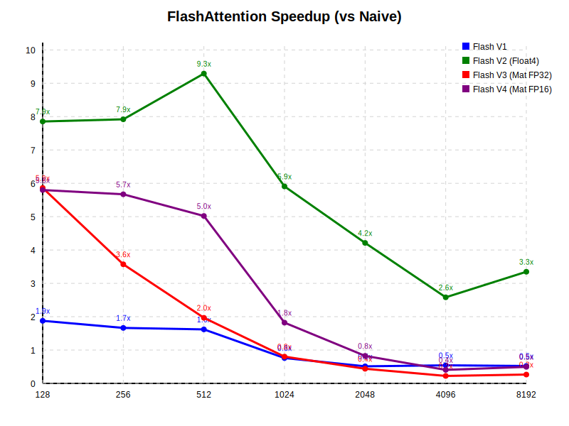

# FlashAttention on Apple Metal

This project implements **FlashAttention** (and various optimized versions) on Apple Silicon GPUs using the **Metal Shading Language (MSL)**. It applies high-performance computing techniques on macOS, including matrix intrinsics (SIMD groups), memory handling, and half-precision optimization.

## Optimization Journey

This project represents my step-by-step exploration of high-performance GPU programming on Apple Silicon, identifying key bottlenecks and hardware behaviors.

### 1. Naive Implementation
**Baseline**: `O = Softmax(Q * K^T) * V`.
- **Method**: Standard matrix multiplications.
- **Bottleneck**: Memory Bandwidth. Requires reading `N * N` elements from HBM, leading to $O(N^2)$ memory accesses.

### 2. FlashAttention V1 (Tiled)
**Goal**: Reduce HBM accesses from $O(N^2)$ to $O(N)$.
- **Method**: Tiling. Loads blocks of $Q, K, V$ into on-chip SRAM (Threadgroup Memory) and computes attention score by score.
- **Result**: Significant speedup over naive, but limited by scalar operations.

### 3. FlashAttention V2 (Vectorized) — **Top Performer**
**Goal**: Maximize memory bandwidth and instruction throughput.
- **Method**:
    - **Vectorization**: Uses `float4` types to load/store 128 bits at a time, saturating the bus.
    - **Register-Heavy**: Keeps almost all intermediate data in registers, minimizing expensive Shared Memory barriers.
- **Result**: Currently the fastest implementation. It perfectly balances occupancy (threads in flight) with resource usage.
- **Key Experiment: Block Size Tuning**:
    - Tried increasing block size from 16x16 to 32x32.
    - **Finding**: Performance regressed due to register spilling.
    - **Decision**: Reverted to **16x16** to maintain high occupancy.

### 4. Causal Masking
**Goal**: Support autoregressive modeling (GPT-style) by masking future tokens.
- **Method**: Added an `is_causal` flag. When enabled, attention scores $S_{ij}$ are set to $-\infty$ if $j > i$.
- **Optimization**: Implemented in shared memory for minimum overhead. Backward pass optimized to handle potential `atomic_add_float` contention during masked updates.

### 5. FlashAttention V3 (Matrix Intrinsics)
**Goal**: Utilize Apple's AMX/Tensor Cores via `simdgroup_matrix` (8x8 tile) intrinsics to speed up the math.
- **Method**: Implemented using `float` precision matrix intrinsics.
- **Result**: Slower than V2.
- **Analysis**: While it uses hardware acceleration, `float` (32-bit) precision data movement is heavy. The overhead of loading 32-bit data into specialized 8x8 matrix tiles outweighs the ALU speedup compared to simple `float4` vector math. This motived the move to V4 (Half Precision).

### 6. FlashAttention V4 (Half + Tensor Cores / Simdgroups) — **The Experiment**
**Goal**: Leverage Apple M-series AMX/Tensor Cores for maximum theoretical TFLOPS using `half` precision and `simdgroup_matrix` intrinsics.
- **Hypothesis**: The specialized hardware for matrix math should beat general-purpose ALUs.
- **Challenges & Optimizations**:
    1.  **Challenge**: V4 was initially slower than V2.
    2.  **Optimization Attempt (Compute)**: Identified an inefficient scaling step. **Optimization**: Replaced it with a "Spill-Scale-Reload" strategy in shared memory.
    3.  **Optimization Attempt (Memory)**: Implemented explicit `uint4` (128-bit) Vectorized Loads with bit-casting.
- **Conclusion**: On M-series GPUs, the overhead of managing `simdgroup` tiles and the mandatory synchronization barriers (memory fences) outweighs the math speedup. The register-heavy, sync-free V2 approach remains superior for these workload sizes.

## Prerequisites

- macOS with Apple Silicon (M1/M2/M3).
- Xcode Command Line Tools installed (`xcode-select --install`).
- Python 3 (for plotting results).

## Build and Run

1. **Compile the project**:
   ```bash
   make
   ```
   This compiles `main.mm` and `kernels.metal` into a `flash_attn` executable.

2. **Run the benchmark**:
   ```bash
   ./flash_attn
   ```
   It will run benchmarks for sequence lengths `128` to `16384` and verify correctness against a CPU reference.
   Results will be saved to `benchmark_results.csv` (printed to stdout in current version, you may need to redirect or just view stdout).

   *Note: usage in `main.mm` currently prints to stdout. To save to CSV for plotting:*
   ```bash
   ./flash_attn > benchmark_results.csv
   ```
   *(make sure you clean up the non-CSV lines from the output if redirecting directly, or just copy the CSV block)*.

3. **Plot Results**:
   If you have a clean CSV file:
   ```bash
   python3 plot_results.py
   ```
   This generates `speedup_plot.svg`.

## Benchmark Results



## Implementation Details

- **Kernels**: Located in `kernels.metal`.
- **Host Code**: Located in `main.mm`.
- **Performance**: **FlashAttention V2** (Vectorized) currently achieves the highest speedups. While V4 introduces FP16 and Tensor Core support, it currently exhibits performance regressions at larger sequence lengths compared to V2, likely due to unoptimized occupancy or overheads.

## References

- [FlashAttention: Fast and Memory-Efficient Exact Attention with IO-Awareness](https://arxiv.org/abs/2205.14135)
- [FlashAttention-2: Faster Attention with Better Parallelism and Work Partitioning](https://tridao.me/publications/flash2/flash2.pdf)
